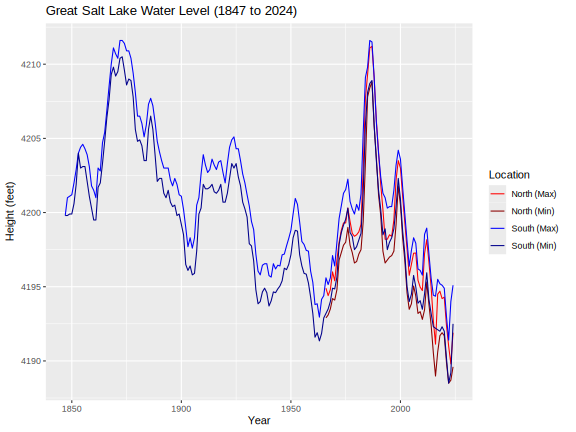
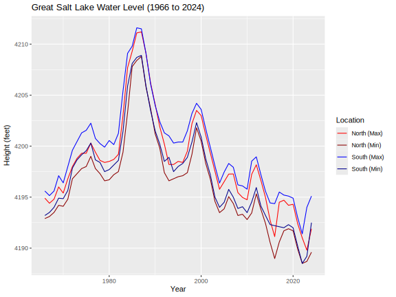
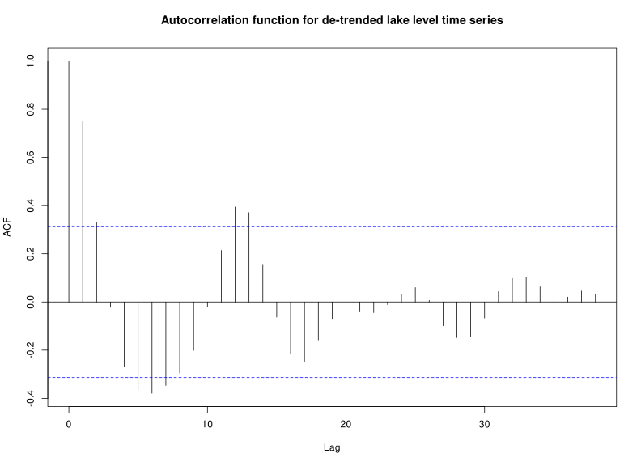

# Summary

A simple (and simplistic) time series analysis, in R, of the Great Salt Lake water levels.  Data is from the USGS National Water Information System.

The data shows statistically significant autocorrelation of lake water levels with a 12-13 year period, since the mid-1980s.  Potential causes other than random variation are unclear.  If you have information on this, I would appreciate learning about it.  Please reach out!

Inspired by 5/16/2024 New York Times article by Flavelle and Popovich (link below).

# Notes

Record keeping increased around 1966, and entered the modern era at the end of 1989.

Accordingly, use of the term "recent" in the code variously refers to any time from 1960s-1990, through 2024.  A starting year was not standardized for terminology purposes-- just tweak it as needed to see what kind of varying results you get.

For example, depending on which starting year is chosen in the 1980s, the time series appears more likely or less likely to be stationary (i.e., by Augmented Dickey Fuller test).

# Sources

## USGS National Water Information System
Accessed 2024-05-24

### North GSL: Saline, UT (Site 10010100)
https://waterdata.usgs.gov/nwis/dv?referred_module=sw&site_no=10010100
https://waterdata.usgs.gov/nwis/dv?cb_62614=on&format=rdb&site_no=10010100&legacy=&referred_module=sw&period=&begin_date=1966-04-15&end_date=2024-05-23

### South GSL: Saltair Boat Harbor (site 10010000)
https://waterdata.usgs.gov/nwis/dv?referred_module=sw&site_no=10010000
https://waterdata.usgs.gov/nwis/dv?cb_62614=on&format=rdb&site_no=10010000&legacy=&referred_module=sw&period=&begin_date=1847-10-18&end_date=2024-05-23

### Other
hat tip: http://www.nytimes.com/2024/05/16/climate/great-salt-lake-water-levels.html

# Results

Plot of Great Salt Lake water level since 1847

Plot of Great Salt Lake water level since 1966 (reproduces NYT graphic)

Autocorrelation plot (lag in years vs. correlation)

Other: augmented Dickey-Fuller tests suggest mean reversion tendencies for most recent time series windows.

ARIMA modeling was just for fun.  Not expected to be a meaningful model.  Starting years in the late 1980s seems to break the forecast plot.  Try different values and see what you get.

# Statement of Originality

This code is an original product of the author (a human).  AI models were NOT used in the development of this code.
